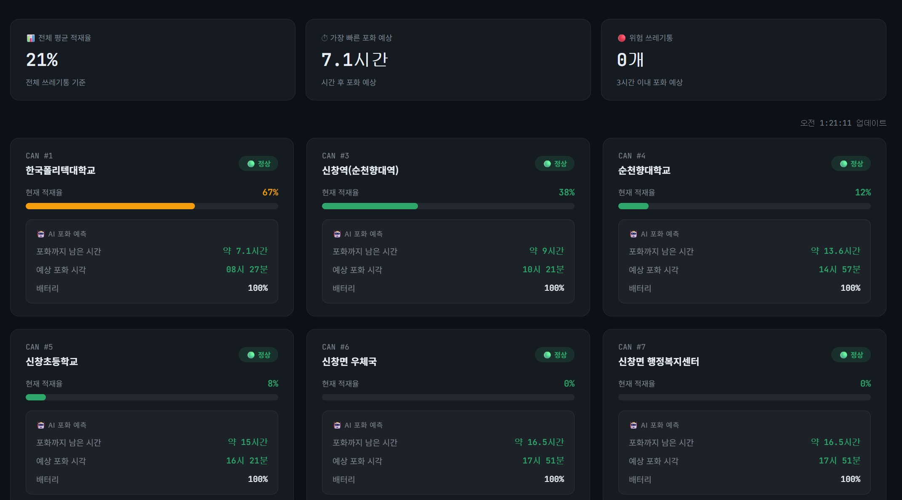
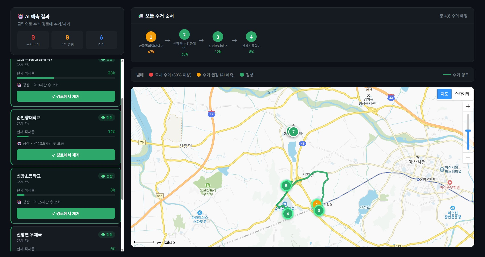
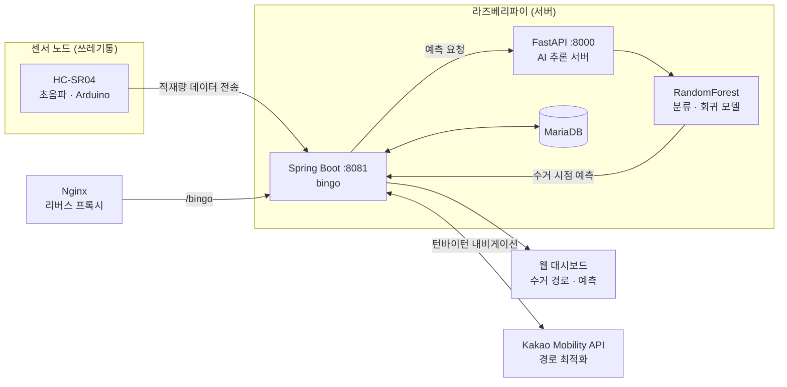

# ♻️ EcoLink BinGo

**IoT/AI 기반 스마트 쓰레기통 수거 최적화 시스템**

라즈베리파이와 초음파 센서로 쓰레기통 적재량을 실시간 수집하고, 위치 특화 자기학습 AI 모델로 수거 시점을 예측하여 최적 수거 경로를 안내하는 팀 프로젝트입니다. 한국폴리텍대학 벤처창업아이템 경진대회 출품을 목표로 개발 중입니다.

<!-- 예:      -->

---

## 📸 스크린샷

> 대시보드/하드웨어 사진을 `docs/images/` 폴더에 추가한 뒤 아래 경로를 실제 파일명으로 교체하세요.

| 대시보드 | 수거 경로 안내 |
|---|---|
|  |  |

---

## 📌 프로젝트 개요

기존 정기 순회 방식의 쓰레기통 수거는 불필요한 출동과 과적재를 동시에 유발합니다. BinGo는 초음파 센서(HC-SR04)로 쓰레기통 적재량을 실시간 수집하고, 위치별로 자기학습하는 AI 모델이 다음 만적 시점을 예측하여 수거 인력이 필요한 시점에만 최적 경로로 출동하도록 돕습니다. 탄소 감축 효과를 정량화하고, 향후 지자체·업체 연동을 위한 개방형 API 플랫폼으로 확장하는 것을 목표로 합니다.

- **개발 기간**: 진행 중 (팀 프로젝트, 경진대회 출품 준비)
- **배포 환경**: 라즈베리파이 홈서버 (`codedbyjun.dev/bingo`)
- **팀 구성**: 전영준(팀장 · AI/프론트엔드), 강대웅, 박승국, 허찬
- **지도교수**: 고호정
- **경진대회**: 한국폴리텍대학 벤처창업아이템 경진대회

---

## 🏗 시스템 아키텍처



### 데이터 흐름
1. **센서 수집**: 쓰레기통(Can ID 1)에 부착된 HC-SR04 초음파 센서가 Arduino를 통해 적재량 데이터를 주기적으로 전송 (Can ID 3~7은 목업 데이터로 시뮬레이션)
2. **이벤트 감지**: 적재량이 30% 이상 급락하는 패턴을 자동 감지해 수거 이벤트로 기록 (`empty_history` 테이블)
3. **백엔드 처리**: Spring Boot(`:8081`, context-path `/bingo`)가 센서 로그를 MariaDB에 저장하고 REST API로 제공
4. **AI 추론**: FastAPI(`:8000`)가 축적된 데이터로 RandomForestClassifier(만적 여부 분류)와 RandomForestRegressor(만적까지 남은 시간 예측)를 수행, 주 1회 주기적 재학습 진행
5. **경로 최적화**: 수거가 필요한 쓰레기통을 기준으로 Kakao Mobility API를 연동해 최적 수거 경로와 턴바이턴 내비게이션 제공
6. **시각화**: 웹 대시보드가 적재 추이, 예측 결과, 수거 경로를 실시간으로 표시

---

## ✨ 주요 기능

- 📊 **실시간 적재량 모니터링** — 쓰레기통별 적재량 추이를 그래프로 시각화 (`trend.html`)
- 🤖 **위치 특화 자기학습 AI** — RandomForest 기반 만적 여부 분류(정확도 99.57%) 및 만적 시점 예측(MAE 1.13h, R² 0.7748)
- 🗺 **수거 경로 최적화** — Kakao Mobility API로 수거 필요 쓰레기통 기준 최적 경로 및 턴바이턴 안내 (`route.html`)
- 🔔 **자동 수거 이벤트 감지** — 적재량 급락 패턴 기반 수거 완료 자동 기록
- 🌱 **탄소 감축 정량화** — 불필요한 출동 감소분을 기반으로 탄소 절감 효과 산출
- 🌐 **개방형 API 플랫폼(예정)** — 외부 지자체·업체 연동을 위한 API 개방 계획
- 🌐 **웹 배포** — 개인 도메인(`codedbyjun.dev/bingo`)에서 서비스 중

---

## 🛠 기술 스택

### 하드웨어
| 구성요소 | 부품 | 인터페이스 |
|---|---|---|
| 적재량 센서 | HC-SR04 초음파 센서 | Arduino |
| 센서 노드 | Arduino | - |
| 서버 | Raspberry Pi | - |

### 백엔드 / AI
| 영역 | 기술 |
|---|---|
| API 서버 | Spring Boot (Gradle), context-path `/bingo` |
| AI 추론 서버 | FastAPI, Python |
| 예측 모델 | RandomForestClassifier / RandomForestRegressor (scikit-learn) |
| 경로 최적화 | Kakao Mobility API |
| 데이터베이스 | MariaDB |
| 웹 서버 | Nginx (리버스 프록시) |
| 배포 | systemd (`ecolink-spring`), Raspberry Pi 홈서버 |

### 프론트엔드
- Thymeleaf
- Vanilla JS (`dashboard.js`)
- Chart.js 기반 실시간 데이터 시각화

---

## 📁 프로젝트 구조

```
backend-spring/
├── src/
│   └── main/
│       ├── java/               # Spring Boot 컨트롤러 · 서비스 · 엔티티
│       └── resources/
│           ├── static/         # trend.html, route.html, trashcan.html, prediction.html
│           ├── static/js/      # dashboard.js
│           └── application.properties
├── build.gradle
└── settings.gradle
```

```
bingo_ai/                       # (별도 저장 · 서버 배포)
├── main.py                     # FastAPI 서버
├── train.py                    # 분류 모델 학습
├── train_regression.py         # 회귀 모델 학습
├── .env                        # DB 접속 정보 (Git 제외)
└── venv/
```

---

## 📄 라이선스

이 프로젝트는 한국폴리텍대학 벤처창업아이템 경진대회 출품 및 팀 학습 목적으로 제작되었습니다.
